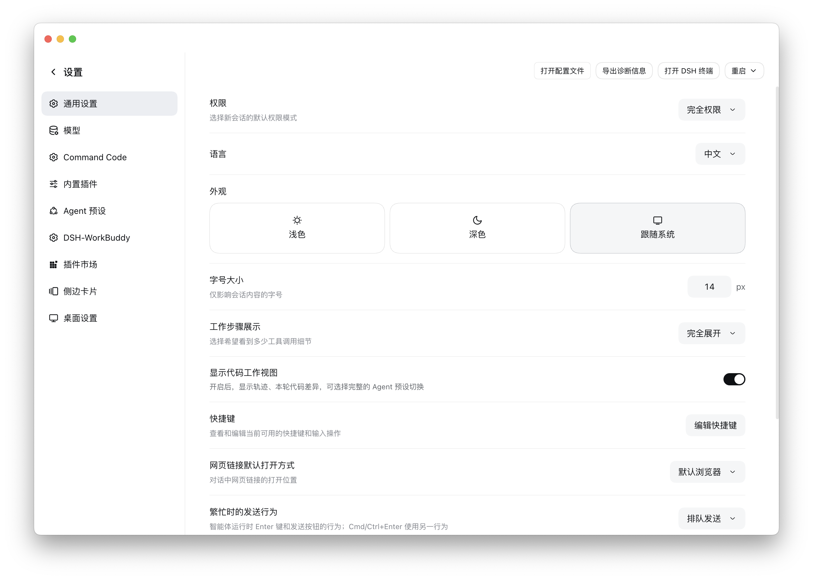

<div align="center">


# dsh-fullscreen-settings

**Turn the DSH settings dialog into a Codex-style full-page settings screen.**


[Issues](https://github.com/functy23/dsh-fullscreen-settings/issues) • [Changelog](CHANGELOG.md) • [中文](README.md) / [English](README.en.md)

</div>

---

## Screenshot



## What changes

| | Before | After |
|---|---|---|
| Shape | 800×800 centered modal over a mask | Full-window page, no mask |
| Exit | Small ✕ at the top right | One "← Settings" row at the top left |
| Rail | 188px | 248px with a hairline divider |
| Content | 800px wide, rows stretched | One column capped at 880px |

The top-left "← Settings" is **a single button**: the arrow and the title share one
hover surface, exactly like the "New session" / "Plugins" rows in the main sidebar.
Clicking either the arrow or the label goes back.

On macOS the top strip automatically clears the traffic lights and doubles as the
window drag region; it collapses when the window is fullscreen.

## Install

### From npm (recommended)

```bash
dsh plugin --profile <profile> add dsh-fullscreen-settings
```

You can also just `npm i dsh-fullscreen-settings` to get the package alone.

### From GitHub

```bash
dsh plugin --profile <profile> add github:functy23/dsh-fullscreen-settings
```

Replace `<profile>` with the one you are installing into (e.g. `web`).

If that profile is managed by a host client and the CLI refuses the install, use the
package name `dsh-fullscreen-settings` (or the repository URL
`github.com/functy23/dsh-fullscreen-settings`) on that client's plugins page instead,
or edit the profile directly — append to
`~/.dsh/profiles/<profile>/cordis.patch.yml`:

```yaml
- insert:
    - id: ui-fullscreen-settings
      name: /absolute/path/to/dsh-fullscreen-settings/lib/index.js
```

Then **refresh the page**; if it does not take effect, **restart the DSH client**.

(The profile patch hot-reloads the host half, but the client module graph is fetched
at page load, so a page load is always required.)

## How it works

The host half is empty (`lib/index.js` only exports an empty `apply()`); everything
happens in the client half, in two independent moves:

1. **One stylesheet**, anchored on the product's own
   `div[data-shortcut-modal="settings"]` attribute and element selectors
   (`> nav` / `> div`) — no CSS Modules hashes, so a rebuild cannot break it.
2. **Shadowing the official `settings.header` single-slot occupant.** A single slot
   renders its lowest-priority entry; the official one sits at priority 0, so this
   plugin registers at `-1000` and becomes the top-left row.

Closing calls `closeTopModal()` from `@deepseek-ai/dsh-client-ui-primitives` — the
very function the official settings shortcut uses — with a click on the official
close button as fallback.

No official file is patched or bundled; if DSH changes a detail after an upgrade,
the worst case is that the styling falls back to the stock dialog.

## Layout

```
dsh-fullscreen-settings/
├─ lib/
│  ├─ index.js        host half: empty apply()
│  └─ client.js       client half: stylesheet + "← Settings" button
├─ tests/
│  └─ client.test.mjs zero-dependency unit tests (node --test)
├─ icon.svg            plugin-list icon (referenced by the package.json icon field)
├─ assets/             README screenshot
├─ cordis.patch.yml   profile-layer patch that mounts the plugin
├─ package.json       dsh.bundle / dsh.client declaration + test script
└─ README.md / README.en.md / CHANGELOG.md / LICENSE
```

`lib/` is the source; there is no build step.

## Compatibility

Verified against DSH `0.2.0-rc.1`. Only product-owned attributes, the slot
contract and theme variables (`--dsw-alias-*` / `--dsh-frame-*`) are used; nothing
depends on a particular desktop shell.

## Rollback

Remove the `- insert:` block (or uninstall it on that profile's plugins page) and
refresh the page (or restart the DSH client).

## License

[MIT](LICENSE) © 2026 Functy
